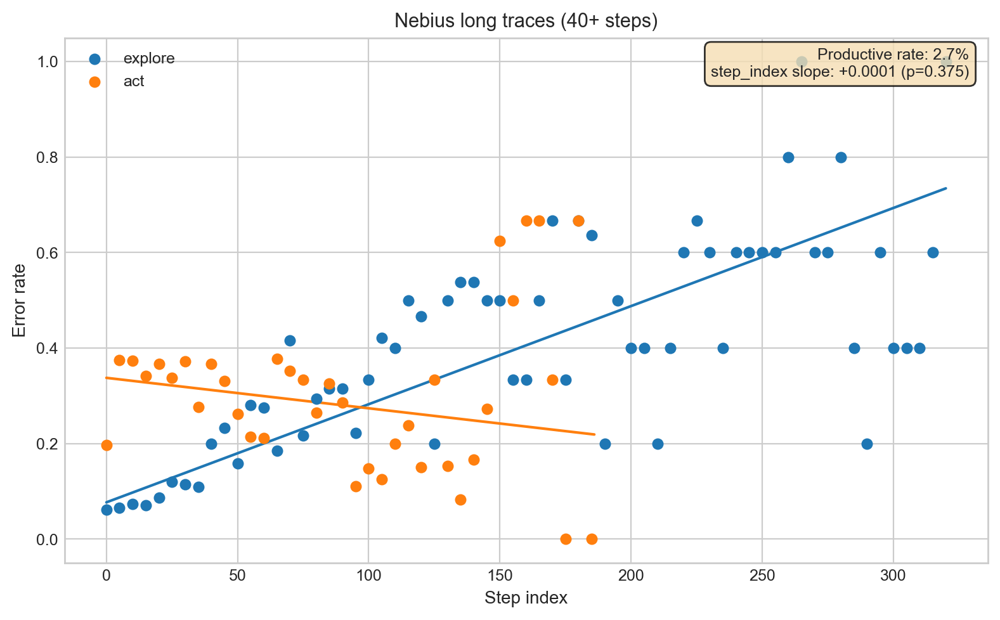
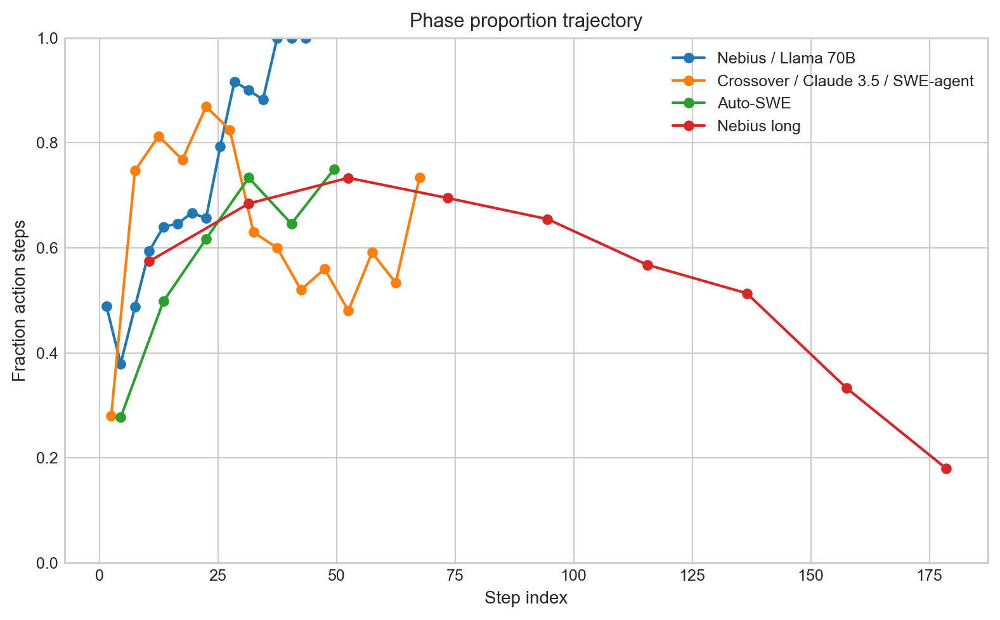
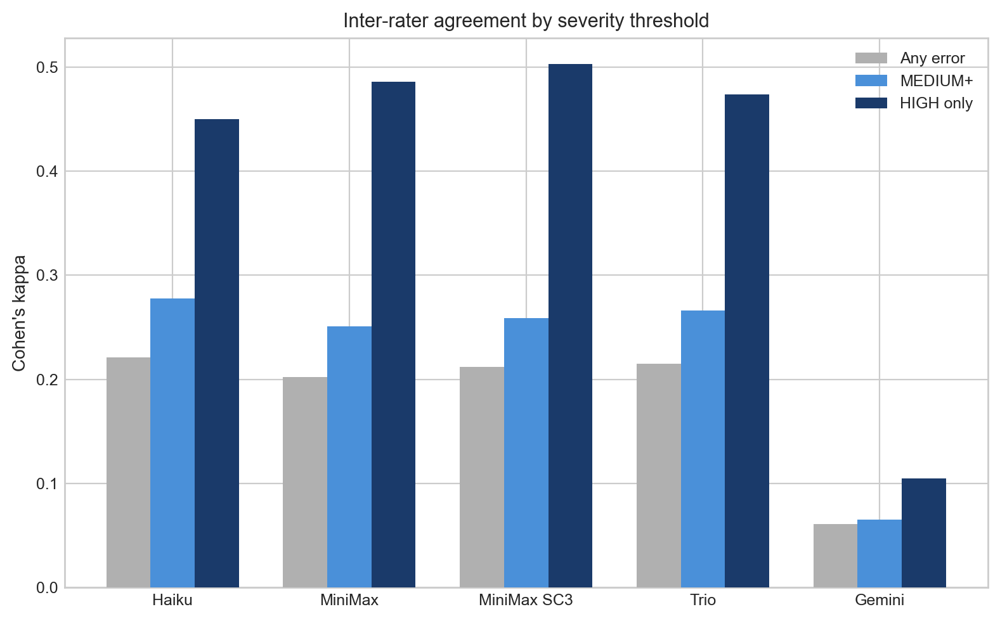

# Findings

Detailed results from the degradation study. For context and methodology, see [README.md](README.md). All analysis was performed using [inspect-degradation](https://github.com/reffdev/inspect-degradation).

**Scope.** 15 configurations across 4 scaffoldings, 8+ models, and 30-50 traces each. Most are SWE-bench Python bug fixes; one dataset (Auto-SWE) is from a custom multi-agent pipeline working on real production tasks.

---

## Methodology correction: grader-context truncation (2026-04-15)

The original Phase 3 grading applied `prior_context_char_budget=30000` to every grader call for cost reasons. The cap was documented in the library as producing "uniform truncation" but did not: truncation rate scaled from 0% at step 0 to 88% at step 25 across the 14 configurations, averaging 197,378 prior-step characters dropped across 13,050 grader calls. Four configurations exceeded 60% average truncation (phase3-long 67%, phase3-autoswe 64%, phase3-openhands-qwen 81%, phase3-msb/claude-3.5-sonnet/openhands 66%). A `.truncation.json` side-file recorded every truncation event, but no analysis script read it. Truncated completions raised parse errors that the grader library silently converted to `Validity.neutral`, so the downstream damage accumulated at later positions.

All 14 truncated configurations were re-graded with `prior_context_char_budget=None`, and re-analyzed with parse-error steps excluded. The cross-dataset summary table below reports the uncapped numbers throughout; cap-vs-uncap side-by-side in [results/compare_all_pairs_final.json](results/compare_all_pairs_final.json).

**Six of the fourteen re-graded configurations changed direction of effect or significance:**

| Configuration | Capped (retracted) | Uncapped (current) |
|---|---|---|
| Nebius long (Llama, 40+ steps) | No effect, +0.0001 p=0.38 | **Degrades, +0.0007 p<0.001** |
| MSB / GPT-4o / SWE-agent | Improves, p<0.0001 | **Degrades, +0.0025 p=0.001** |
| MSB / Claude 3.5 Sonnet / SWE-agent | Improves, p<0.0001 | No effect, +0.0010 p=0.12 |
| MSB / Claude 3.5 Sonnet / OpenHands | Improves, p<0.0001 | **Degrades, +0.0029 p<0.001** |
| MSB / Claude 3.7 Sonnet / OpenHands | Improves, p=0.007 | **Degrades, +0.0014 p=0.001** |
| Auto-SWE / Qwen3-Coder-Next | No effect, p=0.11 | Improves, -0.0009 p=0.034 (raw-p) |

The cap's bias was asymmetric: it hid degradation on MSB and long-trace data, hid improvement on Auto-SWE. Four MSB configurations originally reported as "within-run adaptation" now show degradation or null — the improvement signal was produced by position-correlated grader neutral-bias, not by the agents. Post-correction headline: **5 degrade, 2 improve (1 BH-significant, 1 raw-p only), 7 null.**

Three configurations (phase3-openhands, -openhands-qwen, -swesmith) remain null under both regimes. Two (Terminus, Crossover / Claude 3.5 / SWE-agent) retain their original sign and survive BH correction in both regimes.

### Note on pre-correction sections

Several sections below are flagged *pre-correction* — they report figures produced against the capped caches that have not yet been re-run against the uncapped caches. The headline cross-dataset summary and the per-configuration `step_index` slopes are post-correction throughout. The pre-correction sections are retained because (a) the methodology they describe is still the right diagnostic, (b) the direction of change under uncapping is known from [compare_all_pairs_final.json](results/compare_all_pairs_final.json) even where the specific regressions haven't been re-fit, and (c) the pre-correction results are useful calibration for the kind of artifact the cap produced.

---

## Cross-dataset summary

| Dataset | Model | Scaffolding | Traces | step_index | p-value | Direction |
|---|---|---|---|---|---|---|
| **Crossover** | **Claude 3.5 Sonnet** | **SWE-agent** | 50 | **+0.0016** | **0.024** | **Degrades** |
| MSB | Claude 3.5 Sonnet | SWE-agent | 50 | +0.0010 | 0.119 | No effect |
| Crossover | Claude 3.5 Sonnet | OpenHands | 50 | +0.0007 | 0.162 | No effect |
| **MSB** | **Claude 3.5 Sonnet** | **OpenHands** | 50 | **+0.0029** | **<0.001** | **Degrades** |
| SWE-smith | Claude 3.7 Sonnet | SWE-agent | 30 | +0.0003 | 0.554 | No effect |
| **MSB** | **Claude 3.7 Sonnet** | **OpenHands** | 50 | **+0.0014** | **0.001** | **Degrades** |
| **Terminus** | **GLM 4.7** | **terminus-2** | 50 | **-0.0059** | **<0.001** | **Improves** |
| Crossover | GPT-4o | SWE-agent | 50 | +0.0003 | 0.126 | No effect |
| **MSB** | **GPT-4o** | **SWE-agent** | 50 | **+0.0025** | **0.001** | **Degrades** |
| OpenHands | GPT-4o | OpenHands | 50 | -0.0013 | 0.321 | No effect |
| **MSB** | **GPT-4o** | **OpenHands**¹ | 50 | **-0.0003** | **0.020** | **Improves** |
| Nebius | Llama 70B | SWE-agent | 30 | +0.0030 | 0.055 | No effect (borderline) |
| **Nebius long** | **Llama all (40+ steps)** | **SWE-agent** | 50 | **+0.0007** | **<0.001** | **Degrades** |
| OpenHands | Qwen3-Coder-480B | OpenHands | 30 | +0.0002 | 0.321 | No effect |
| **Auto-SWE** | **Qwen3-Coder-Next (6 models)** | **Custom pipeline** | 50 | **-0.0009** | **0.034** | **Improves** |

All coefficients are from mixed-effects linear probability models on **uncapped** grader caches with parse-error steps excluded, random intercept for task, controlling for step phase, complexity, and outcome where available. Five of the slopes above survive Benjamini–Hochberg FDR correction across the 14-pair re-grading family (see [§ Methodology correction](#methodology-correction-grader-context-truncation-2026-04-15) above). Full reports in `results/analysis-reports/`; cap-vs-uncap comparison in [results/compare_all_pairs_final.json](results/compare_all_pairs_final.json).

¹ Not re-graded: the original MSB/GPT-4o/OpenHands run had 0% truncation, so the capped and uncapped grades are identical.

**Five configurations show degradation.** The pattern is concentrated in Multi-SWE-bench and long-trace data: 3 of 4 re-graded MSB configs, the long-trace follow-up, and Crossover/Claude 3.5/SWE-agent. Two configurations show improvement (Terminus GLM 4.7, Auto-SWE). Seven are null.

**The degradation signal is not model-specific.** GPT-4o, Claude 3.5 Sonnet, Claude 3.7 Sonnet, and Llama (70B/8B/405B mix) all show degradation on at least one configuration. Qwen3-Coder-480B is the only model with no degradation signal across any framework tested.

**Outcome-control test (2 MSB / SWE-agent configs).** Resolved status was backfilled from Multi-SWE-bench trajectory `score` fields. Adding `trace_success` to the model does not change the direction or magnitude of the step_index slope meaningfully. Outcome labels could not be obtained for the 3 OpenHands configs or Terminus (trajectory files do not include a `score` field).

**Floor effect.** MSB/GPT-4o/OpenHands (0.3% error rate baseline) has only 4 total errors across ~1500 steps; its improvement coefficient is tiny and should be treated as a floor-effect artifact rather than a signal.

The improvement signals from Terminus and Auto-SWE are the two remaining substantive cases. Terminus lacks an outcome label (`success=None`), so the improvement cannot be distinguished from survivorship selection there. Auto-SWE improves at raw p=0.034 but does not survive BH correction across the family.

**Step-phase classifier.** The explore/act classifier uses framework-aware detection layers: Auto-SWE structured tool calls, OpenHands bracket commands with subcommand parsing (e.g., `[str_replace_editor] view` -> explore, `[str_replace_editor] str_replace` -> act), XML blocks for SWE-agent/terminus, and a shell-command fallback.

Validation accuracy by framework:

| Framework | Method | Accuracy |
|---|---|---|
| Auto-SWE | Verified against ground-truth tool names | 100% (1177 steps) |
| SWE-agent | 100-step random sample, human-reviewed | 98-100% (100 steps) |
| OpenHands | Manual inspection | Zero known misclassifications |
| Terminus | Uses same XML/shell pipeline as SWE-agent | Not independently validated |

SWE-agent validation: 100 randomly sampled steps from 30 Nebius/Llama 70B traces (seed=42). 74 classified as act, 26 as explore. 1-2 borderline cases where the agent is reasoning about code structure with no explicit command (defaults to act). See `scripts/validate_step_phase.py` to reproduce or extend the validation.

---

## The phase-composition confound

Successive controls on the raw per-trace slope for Nebius / Llama 70B (30 traces):

| Estimate | Value | p-value | Controls |
|---|---|---|---|
| Raw per-trace OLS | ~+0.020/step | varies by trace | Nothing |
| Mixed-effects (no phase) | positive (not re-estimated uncapped) | — | Complexity, outcome, task variance |
| Mixed-effects (with phase) | **+0.0030/step** | **0.055** | All above + explore vs act |

Agents explore early (reads, searches — low error rate) and act late (edits, test runs — high error rate), so any temporal signal is mechanically confounded with phase composition. The phase covariate approximately halves the raw slope but does not drive it to zero — the phase-composition story alone does not explain the Nebius data under uncapped grading. On larger samples and longer traces (phase3-long, four re-graded MSB configurations) the phase-controlled slope remains significantly positive.

Extending to other frameworks surfaced a separate issue: the step-phase classifier, originally designed for SWE-agent's shell commands, misclassified 30–60% of steps on frameworks using structured tool calls. Fixing the classifier addressed how the explore/act axis was measured; the uncap fix addressed what context the grader saw. Both interventions were needed.

---

## Per-configuration detail: the two configurations that reversed

These two configurations are featured because each is an especially informative case of the methodology correction: Auto-SWE flipped from null to improvement, the long-trace follow-up flipped from null to BH-significant degradation. Both `step_index` slopes are post-correction; other covariates (step_phase, model contrasts, ICC) are from the original capped regressions and are retained for context.

### Auto-SWE / Custom multi-agent pipeline (n=50, 6 models)

A fully autonomous multi-agent pipeline where a director agent generates milestones and tasks and delegates to scout/implement/test/review stages. Task instructions are agent-generated, not human-written.

| Coefficient | Estimate | 95% CI | p-value | Significant? |
|---|---|---|---|---|
| step_index (uncapped) | **-0.0009/step** | [-0.00170, -0.00007] | **0.034** | Raw-p yes; not BH-significant |
| step_phase (explore)¹ | -0.110 | [-0.143, -0.077] | <0.0001 | Yes |
| Qwen3-REAP vs Qwen3-Coder-Next¹ | +0.108 | [+0.040, +0.177] | 0.002 | Yes |
| Gemini 3.1 Pro vs Qwen3-Coder-Next¹ | +0.193 | [+0.096, +0.289] | 0.0001 | Yes |
| ICC¹ | 0.054 | | | |

¹ Pre-correction (capped) estimate.

Auto-SWE flipped from null to raw-p significant improvement — error rates *decrease* with step index, opposite the original null direction. The effect is small and does not survive BH correction. Interpretation should be tempered by the absence of a ground-truth outcome label (Auto-SWE has a process-completion proxy but not resolution), so improvement is not distinguishable from survivorship selection with the currently available data. Six models tested in one framework with significant quality differences; explore steps have 11pp lower error rate than act steps.

### Long-trace follow-up (40+ steps, n=50, 3800 steps)

Targeted run to test whether degradation appears under context-window pressure, using traces with 40+ steps across the three Llama variants (70B, 8B, 405B). Under the original capped grading, 67% of grader calls on this configuration had prior content truncated (101,557 prior-step chars dropped) — the grader was structurally prevented from seeing the long context the experiment was designed to pressure-test.

| Coefficient | Estimate | 95% CI | p-value | Significant? |
|---|---|---|---|---|
| step_index (uncapped) | **+0.0007/step** | [+0.00041, +0.00102] | **<0.001** | Yes (survives BH-FDR) |
| step_phase (explore)¹ | -0.176 | [-0.212, -0.139] | <0.0001 | Yes |
| ICC¹ | 0.198 | | | |

¹ Pre-correction (capped) estimate.

The long-trace experiment reverses its headline result: under uncapped grading, degradation appears at +0.0007/step (p<0.001, survives BH-FDR across the 14-pair family). Over a 100-step trace this adds 7pp in expected error rate — non-negligible relative to the 26% baseline. Model identity was not significant in the original capped analysis (70B, 8B, 405B performed similarly) and has not been re-estimated.

 *(figure is from pre-correction data; regenerate before citing.)*

---

## Observations across configurations (pre-correction)

Error-rate ranges shift modestly under uncapped grading (baseline rose ~1–6pp on re-graded configs; see `err_rate_cap` vs `err_rate_unc` fields in [compare_all_pairs_final.json](results/compare_all_pairs_final.json)). Cascade and autocorrelation have not been re-estimated.

**Error rates varied widely by model.** Llama 70B: 26%, GPT-4o: 12%, Auto-SWE (multiple): 7.3%, Claude 3.7: 4%, Qwen3-Coder: 2.1%.

**Complexity effects reversed between models.** Llama: higher complexity → fewer errors. Claude: higher complexity → more errors (p=0.0002). One interpretation: Llama's grader labels are capturing "if the agent got it right, the step must have been easy" (post-hoc rationalization in the complexity judgment). Another: Claude actually struggles more on hard steps while Llama fails uniformly. Whether this reflects model behavior or grader calibration is unclear — disentangling them would require human complexity labels.

**Errors are independent, not cascading.** Mean cascade chain length 1.06 across all datasets. Cascade chains are computed from consecutive error labels, so late-step errors the capped pipeline missed don't appear as chain continuations — the 1.06 is a lower bound, and the true cascade length under uncapped grading is likely higher.

**Autocorrelation is weak.** Lag-1 ACF 0.063; Ljung-Box rejection near nominal level. Validates the regression's independence assumption under capped grading; not re-estimated post-correction.

---

## Phase robustness analysis (pre-correction)

The step-phase covariate (`C(step_phase)`) is the most powerful confound control in the regression. If it overcorrects — absorbing real degradation signal that travels along the same axis as the explore-to-act shift — null results could be false negatives. Three analyses test this; numbers below are from capped caches and four of the MSB entries direction-reverse under uncapping.

**Interaction model.** Adding `step_index * C(step_phase)` tests whether degradation exists *within* each phase. Of 15 configs under capped grading, 11 showed non-significant interactions (p > 0.05). 4 showed significant interactions: Nebius long (p=0.003), MSB/GPT-4o/SWE-agent (p=0.016), Crossover/Claude 3.5/SWE-agent (p=4.4e-06), and MSB/Claude 3.5/OpenHands (p=1.3e-04).

**Phase-stratified regressions.** Fitting separate regressions on just-action and just-explore steps eliminates the covariate entirely.

| Config | Act slope | Act p | Explore slope | Explore p |
|---|---|---|---|---|
| Crossover / Claude 3.5 / SWE-agent | +0.0026 | 0.013 | +0.0005 | 0.069 |
| MSB / Claude 3.5 / SWE-agent | -0.0026 | <0.0001 | -0.0017 | <0.001 |
| Crossover / Claude 3.5 / OpenHands | +0.0006 | 0.410 | +0.0013 | 0.085 |
| MSB / Claude 3.5 / OpenHands | -0.0017 | <0.0001 | -0.0001 | 0.773 |
| SWE-smith / Claude 3.7 | -0.0001 | 0.925 | -0.0001 | 0.768 |
| MSB / Claude 3.7 / OpenHands | -0.0003 | 0.009 | -0.0001 | 0.311 |
| Terminus / GLM 4.7 | -0.0094 | <0.0001 | -0.0037 | 0.016 |
| Crossover / GPT-4o / SWE-agent | +0.0002 | 0.395 | +0.0010 | 0.048 |
| MSB / GPT-4o / SWE-agent | -0.0041 | <0.0001 | -0.0022 | <0.001 |
| OpenHands / GPT-4o | -0.0003 | 0.911 | -0.0030 | 0.003 |
| MSB / GPT-4o / OpenHands | -0.0004 | 0.017 | NaN | NaN |
| Nebius / Llama 70B | +0.0017 | 0.433 | +0.0008 | 0.626 |
| Nebius long | -0.0002 | 0.538 | +0.0001 | 0.659 |
| OpenHands / Qwen3-Coder | +0.0004 | 0.147 | +0.0002 | 0.287 |
| Auto-SWE | +0.0011 | 0.081 | +0.0003 | 0.246 |

The original interpretation held that the within-phase MSB improvements demonstrated genuine within-run adaptation rather than phase-composition artifact. Under uncapped grading the aggregate MSB improvement signals retract (see [methodology correction](#methodology-correction-grader-context-truncation-2026-04-15)), so the within-phase improvement values in this table reflect cap-induced neutral-bias, not adaptation. The Crossover/Claude 3.5/SWE-agent signal (within-action +0.0026 p=0.013) is consistent with its uncapped main-effects result.

**Phase-proportion trajectory.** Phase-step correlation ranges from -0.93 (Nebius long) to 0.96 (Nebius). Most configs show strong positive correlation (r > 0.5), confirming the collinearity.

Full pre-correction results in `results/analysis-reports/phase-robustness-summary.txt`.

---

## Power analysis

The power analysis tool was run against the actual study parameters (80 Monte Carlo simulations per cell, flip_probability=0.12 from HIGH-only validation) to determine the minimum detectable effect (MDE) at 80% power. The flip rate corresponds to the grader's effective operating threshold (HIGH-only); power for MEDIUM-severity errors would be lower due to the higher flip rate at that threshold (0.286).

**Minimum detectable effect at 80% power:**

| Corpus shape | MDE |
|---|---|
| 30 traces, 15 steps/trace | >0.01/step |
| 30 traces, 25 steps/trace | ~0.01/step |
| 30 traces, 40 steps/trace | ~0.005/step |
| 50 traces, 15 steps/trace | >0.01/step |
| 50 traces, 25 steps/trace | ~0.01/step |
| 50 traces, 40 steps/trace | ~0.005/step |

MDEs are roughly consistent across base rates (0.05-0.20), meaning the LPM approximation is not distorting power at the extremes.

**Interpretation.** Most study configurations (30-50 traces, 15-25 steps) can reliably detect a slope of 0.01 errors/step — a 15-step trace accumulating 15% more errors by its end. Slopes of 0.005/step (7.5% more errors over 15 steps) are only reliably detectable in the long-trace follow-up (40+ steps). Slopes below 0.002/step were originally characterized as "undetectable at these sample sizes."

**Revised view after the methodology correction.** Under uncapped grading, several configurations produced statistically significant slopes *below* the 0.01/step MDE floor: phase3-long +0.0007 p<0.001, MSB/Claude 3.7/OpenHands +0.0014 p=0.001, phase3-autoswe-implement +0.0007 p=0.009. The MDE table was therefore conservative in the wrong direction — it understated the study's effective sensitivity by using a flip-probability (0.12, HIGH-only) that did not account for the reduction in parse-error fallbacks once truncation was removed. The practical implication is that the "cannot distinguish no-degradation from very-small-degradation" hedge in the original interpretation is too strong: the study can and does detect sub-0.005/step slopes on configurations with 50 traces and longer average trace lengths, as long as the grader sees the full context. Full pre-correction power table in `results/analysis-reports/power-analysis.txt`.

---

## Grader validation

Grader validation against [TRAIL benchmark](https://github.com/patronus-ai/trail-benchmark) (148 expert-annotated traces, 954 step pairs).

### Configuration

| Label | Model | Config | Cost tier |
|---|---|---|---|
| minimax | `minimax/minimax-m2.5` | Single sample | $0.40/M in |
| haiku | `anthropic/claude-haiku-4.5` | Single sample | ~$0.80/M in |
| gemini | `google/gemini-2.5-flash-lite` | Single sample | cheapest |
| minimax_sc3 | `minimax/minimax-m2.5` | 3-sample self-consistency | 3x minimax |
| trio | haiku + minimax + gemini | Majority-vote ensemble | 3x (3 models) |
| sonnet | `anthropic/claude-sonnet-4-6` | Single sample, 10-trace subset | ~$3/M in |
| kimi | `moonshotai/kimi-k2.5` | Single sample, 50-trace subset | ~$0.40/M in |

Sonnet and Kimi were run on subsets (10 and 50 traces respectively) rather than the full 148-trace corpus, to limit cost. Their results are directional, not directly comparable to the full-corpus runs.

### Severity-threshold analysis

TRAIL labels each error with impact LOW/MEDIUM/HIGH. Recomputing kappa at stricter thresholds reveals that graders apply a higher bar for "error" than TRAIL's annotators:

| Threshold | Haiku | MiniMax | MiniMax SC3 | Trio | Gemini |
|---|---|---|---|---|---|
| Any error = fail | 0.221 | 0.202 | 0.212 | 0.215 | 0.061 |
| MEDIUM+ only | 0.278 | 0.251 | 0.259 | 0.266 | 0.065 |
| HIGH only | **0.450** | **0.486** | **0.503** | **0.474** | 0.105 |

Reference fail counts: 395 (any) -> 326 (MEDIUM+) -> 148 (HIGH only), out of 954 total steps.

At HIGH-only, four of five graders reach kappa ~0.45-0.50 (moderate agreement). The disagreement is concentrated on LOW-impact errors -- cosmetic issues (missing closing tags, typos, formatting) that don't change tool behavior. This pattern held across all 5 model families, suggesting it reflects something general about how LLMs judge errors rather than a quirk of any particular model.

**Construct mismatch: decision quality vs outcome contribution.** The 73% false-negative rate at MEDIUM+ likely overstates the grader's actual failure rate. The grader judges each step under a no-hindsight constraint -- using only prior context, without seeing future steps. TRAIL's human annotators labeled traces after the fact with full knowledge of how each step's consequences played out. An edit that compiles and looks correct at step 3 but turns out wrong when a test fails at step 60 is a *good decision* (the grader's construct) but a *bad outcome contribution* (TRAIL's construct). The grader says pass; TRAIL says fail. This is not grader error -- it is a construct mismatch.

The implication: kappa against hindsight-informed reference labels systematically underestimates grader accuracy on the construct the grader actually measures. The 73% FNR reflects the fraction of errors that are only identifiable with future context, not the fraction of detectable errors the grader misses. At HIGH-only -- where errors are severe enough to be recognizable at decision time (corrupted state, hallucinated facts, explicitly violated instructions) -- kappa reaches 0.49, consistent with moderate agreement on a genuinely measurable construct.

This generalizes to any LLM-as-judge rubric with a no-hindsight constraint validated against hindsight-informed labels. The solution is not to remove the constraint (which prevents penalizing reasonable decisions with bad outcomes) but to validate against labels that reflect the same construct, or to decompose disagreement into "detectable at decision time" vs "requires future context."

**TRAIL's labels may themselves limit achievable kappa.** An attempt to classify MEDIUM+ false negatives by hindsight-dependence (`scripts/classify_fn_ui.py`) revealed that TRAIL's category labels are often too vague to support reliable classification even with full trace access: "Instruction Non-compliance" does not identify which instruction, and many steps are nested LLM calls rather than concrete actions. Kappa against TRAIL may be a lower bound on inter-rater agreement with any reviewer, including the TRAIL annotators themselves.

### Rubric iteration

Two rubric variants (v2, v2.1) were tested to align the grader's error threshold with TRAIL MEDIUM+. A frontier model (Kimi K2.5) was also tested. The rubric variants and Kimi were evaluated on a 50-trace subset (670 step pairs) rather than the full corpus, which is why the sample sizes differ from the table above.

| Config | Sample | Binary kappa | HIGH only | Severity kappa |
|---|---|---|---|---|
| MiniMax v1 | n=954 | 0.202 | 0.486 | 0.077 |
| MiniMax v2.1 | n=670 | 0.029 | - | 0.247 |
| Kimi v1 | n=670 | 0.064 | 0.312 | 0.394 |

**Rubric changes hurt validity agreement.** v2.1 added a single sentence to the fail definition: "missing closing tags, typos in non-functional text, and formatting issues that do not change tool behavior or agent reasoning are not failures." This was intended to align the grader with TRAIL's MEDIUM+ threshold. Instead, binary kappa collapsed from 0.202 to 0.029. The most likely explanation: "does not change tool behavior" is subjective, and the grader interpreted it as permission to downgrade many real errors to neutral, not just cosmetic ones. The exception gave the grader an escape hatch it used too aggressively.

v2 changed three things simultaneously (severity exception, removed conservative bias, trimmed cross-step signals), making it impossible to isolate which change caused the damage. v2.1 isolated the severity exception alone and still failed, confirming that the cosmetic exception language itself is the problem.

This has implications for the position-dependent accuracy findings. The v1 rubric's conservative bias ("default toward neutral", "tie-break downward") may be what keeps grader accuracy from degrading *faster* at later steps. Removing it (as v2 did) would likely worsen the position effect. The rubric's strictness is a feature, not a bug -- but it also means the grader systematically under-reports errors, which biases the degradation slope toward zero.

**Frontier models do not improve grading** -- Kimi, Sonnet, and Gemini all underperformed MiniMax and Haiku. Self-consistency helped only at the HIGH threshold. The ensemble hypothesis (cross-family majority vote) did not beat the best single model at any threshold.

### Grader selection for degradation analysis

- **Rubric**: v1 (unchanged -- iteration had negative returns)
- **Error threshold**: effectively HIGH-only. The grader was initially described as calibrating to MEDIUM+, but position-specific validation showed a 73% false-negative rate at MEDIUM+ (91% at later steps). The grader reliably detects HIGH-severity errors (flip rate 0.12) and ignores most MEDIUM-severity ones.
- **Grader**: MiniMax, single sample. Kappa ~0.49 at HIGH, ~0.25 at MEDIUM+. Cheapest model matching Haiku-level accuracy.
- **Neutral**: retained as exploratory signal; primary claims use binary fail/not-fail

### Length-dependent grader accuracy (Phase 1 / TRAIL)

Grader kappa against TRAIL drops from 0.33 (steps 0–2) to 0.03 (steps 6+). The original framing called this "position-dependent grader conservatism" and generalized it to LLM judges broadly. Stratifying the same kappa by cumulative prior-step character count reveals it is at least partly a length-dependent accuracy decay — long inputs, not step position per se, drive the kappa drop.

TRAIL traces have dramatic prior-step content growth with position (at 3–4 chars/token, p99 at step 10 is ~114K tokens):

| step_idx | n traces | p50 chars | p90 chars | p99 chars |
|---|---|---|---|---|
| 3 | 109 | 17,779 | 117,697 | 140,591 |
| 5 | 47 | 22,716 | 191,612 | 339,716 |
| 10 | 22 | 49,235 | 91,302 | 420,962 |

**Marginal kappa by prior-step length (MiniMax, n=954 paired steps):**

| length | n | kappa |
|---|---|---|
| <10K | 344 | +0.147 |
| 10–50K | 361 | **+0.226** |
| 50–200K | 238 | +0.094 |
| >200K | 11 | +0.029 |

Kappa peaks at 10–50K chars and decays at longer inputs. The <10K row is low due to severe class imbalance (only 3.2% of predictions are `fail` when gold fails are 26.5% — the grader under-predicts the minority class, tanking kappa independent of length).

**Joint kappa (position × length, MiniMax):**

| pos \ len | <10K | 10–50K | 50–200K | >200K |
|---|---|---|---|---|
| 0–2 | +0.15 (n=339) | +0.27 (n=97) | — (n=2) | — (n=0) |
| 3–5 | — (n=5) | +0.18 (n=152) | +0.11 (n=54) | — (n=6) |
| 6–9 | — (n=0) | -0.06 (n=92) | +0.09 (n=28) | — (n=4) |
| 10+ | — (n=0) | +0.19 (n=20) | +0.04 (n=154) | — (n=1) |

Haiku shows the same length-decay pattern (kappa 0.275 at 10–50K → 0.059 at 50–200K → -0.375 at >200K). This is not grader-specific, consistent with long-context decay as a general LLM property.

**Position and length are heavily confounded in TRAIL.** 339/438 steps at position 0–2 have <10K prior chars; 154/175 steps at position 10+ have 50–200K prior chars. The diagonal corners are effectively empty. Within matched-length cells (e.g., the 50–200K column), kappa goes +0.11 (3–5) → +0.09 (6–9) → +0.04 (10+) — a direction consistent with a residual position effect, but the absolute differences are small and the middle cell has only n=28. TRAIL-scale data cannot cleanly disentangle position from length.

**Reframing:** the more defensible claim is *"grader kappa decays with prior-step input length; step position correlates with length in agent traces; the position-dependent curve is at least partly driven by length-dependent accuracy decay."* Whether a strong long-context grader (Gemini 2.5 Pro, Claude Opus 4.5 at 200K) shows a flatter length curve is an open question out of scope for this study. Reproduce via [scripts/phase1_length_stratification.py](scripts/phase1_length_stratification.py).

### Grader sensitivity test

The same 30 Nebius/Llama 70B traces (632 steps) were re-graded with Haiku to test whether the degradation slope is sensitive to grader choice. Both graders are reported here under **uncapped grading** with parse-error steps excluded (the 30K cap had truncated 32% of Haiku's JSON completions on the original capped run, producing 201/632 parse-error steps that silently became neutral; under uncapping that drops to 0):

| Grader | Slope (with phase) | 95% CI | p-value |
|---|---|---|---|
| MiniMax | +0.0030 | [-0.00007, +0.00603] | 0.055 |
| Haiku | +0.0117 | [+0.00844, +0.01487] | <0.001 |

Both graders trend positive under uncapped grading. Haiku finds significant degradation; MiniMax is borderline null (CI crosses zero by 0.00007). The ~4× magnitude gap between graders is real — the two models clearly calibrate the "fail" boundary differently — but the direction of effect is consistent. This is a weaker sensitivity signal than the capped analysis suggested, where MiniMax's slope was attenuated to null by a combination of truncation-induced neutral-bias at late steps, the phase covariate, and the parse-error fallback pathway.

**Retracted: the "+0.007 convergence on agreed steps" finding.** The original analysis decomposed MiniMax's capped null into "agree-only" (+0.0077) and "disagree-only" (-0.0219) subsets and attributed the null to late-step conservatism canceling a real signal. Under uncapped grading MiniMax no longer produces a null on the full sample, so there is no null to decompose. The agreement-subset analysis has not been re-run on uncapped caches; treat the "+0.007" number as a capped-grading artifact until it is. See [scripts/grader_correction_analysis.py](scripts/grader_correction_analysis.py).

**Position-specific flip rates and SIMEX (pre-correction).** Prior analysis on TRAIL found the grader's effective operating threshold is HIGH-only: flip rates were 0.242 (steps 0–4) to 0.364 (steps 5+) at MEDIUM+, with 73% false-negative rate overall and 91% at later steps. The SIMEX correction (0.12) is calibrated to the HIGH-only rate. TRAIL/Phase 1 grading was already uncapped, so these flip-rate estimates are not distorted by the 30K cap — but the position-kappa curve is partly a long-input-length decay artifact rather than intrinsic position bias (see [§ Length-dependent grader accuracy](#length-dependent-grader-accuracy-phase-1--trail) above). The study still measures degradation of HIGH-severity errors only; MEDIUM-severity degradation is undetectable with this grader.

---

## Ablations (pre-correction)

Three ablation analyses originally tested robustness of the capped null result. The "model size" and "within-phase step position" conclusions are the most affected by the re-grade: the Nebius long-trace null they established has since flipped to +0.0007 p<0.001 under uncapping. See `scripts/ablations.py`.

**Trace length.** Splitting each configuration at the median trace length, short traces showed marginally positive slopes (Nebius: +0.014, p=0.09; Nebius long: +0.003, p<0.001) while long traces were flat (slopes <0.001, p>0.7). Originally interpreted as survivorship (short traces that fail fast have steeper error trajectories) — that interpretation likely still holds qualitatively, but "long-traces-are-flat" is directly contradicted by the uncapped Nebius-long result above.

**Model size.** On the capped Nebius long-trace dataset (Llama 70B: 41 traces, 8B: 8 traces), neither model size showed degradation: 70B slope +0.0001 (p=0.74), 8B slope +0.0002 (p=0.43). Error rates differed (70B: 26.6%, 8B: 32.4%) but slopes did not. Under uncapped re-grading the Llama-70B / Nebius slope is +0.0030 and the pooled Nebius-long slope is +0.0007, so the "capacity does not interact with step position" claim needs the 8B stratum re-estimated.

**Within-phase step position.** Fitting on action steps only produced non-significant slopes under capped grading: Nebius +0.0017 (p=0.43), Nebius long -0.0002 (p=0.54). The generalized "phase covariate is not hiding within-phase degradation" claim has since retracted for MSB (see [Phase robustness](#phase-robustness-analysis-pre-correction) above).

---

## Practical guidance for LLM-as-judge temporal analyses

**Do not cap grader context without instrumenting the cap.** This pipeline applied a 30K prior-context character budget to every grader call, recorded truncation events in a side-file (`.truncation.json`) that the analysis scripts never read, and produced the six direction-of-effect reversals described above. Truncation rate scaled with step index — 0% at step 0, 88% at step 25 — so "grader accuracy as a function of step position" was unavoidably "grader accuracy as a function of truncation exposure." If capping is required for cost, the cap should be enforced uniformly across positions by either (a) using a rolling window that truncates head content rather than tail, or (b) explicitly modeling truncation exposure as a covariate in downstream regressions.

**Handle parse-error steps explicitly.** The grader library falls back to `Validity.neutral` on any parse failure — truncated completions, rate-limit exhaustion, provider errors — without surfacing this to downstream analyses unless the analyst specifically filters on `raw.parse_error`. Parse-error neutrals stack with rubric-induced neutral bias and with truncation-induced late-step parse errors. Analyses should drop parse-error steps by default and treat their inclusion as an explicit decision. [compare_all_pairs.py](scripts/compare_all_pairs.py) demonstrates the pattern.

**Two-grader diagnostic, with caveats.** Running a second grader on the same traces is a cheap diagnostic for grader-specific bias (under $1 to re-grade 632 steps with Haiku). However, the specific agreement-subset decomposition this study originally performed (comparing MiniMax and Haiku slopes on agreed steps) was run against capped caches where Haiku had 32% parse-error steps due to truncation-induced completion cutoff. Cross-grader agreement analyses should confirm both graders are running uncapped or under matched truncation regimes before interpreting divergence.

**Apply multiple-comparisons correction within-family.** The original analysis reported 15 configuration-level regressions at raw α=0.05 with no correction, producing an expected 0.75 false positives by chance. This document now reports BH-FDR-corrected outcomes within the 14-pair re-grade family ([compare_all_pairs_final.json](results/compare_all_pairs_final.json)).

**Position-stratified noise correction.** The current SIMEX uses a single flip probability (0.12, HIGH-only). A position-stratified variant would compute separate flip rates for early and late steps. At the HIGH-only threshold the flip rate is stable across positions so this is unnecessary, but at MEDIUM+ where position dependence is stronger (0.24 early, 0.36 late) it would matter for a future grader that operates at a lower threshold — especially combined with the length-dependent kappa decay documented in [§ Length-dependent grader accuracy](#length-dependent-grader-accuracy-phase-1--trail).

---

## Limitations

- **The rubric has not been validated by human experts.** No inter-rater reliability study has been conducted with this rubric. The construct mismatch (decision quality vs outcome contribution) means validating against TRAIL underestimates grader accuracy on the grader's own construct, but confirming this requires decomposing TRAIL's labels by whether each error was detectable without future context. TRAIL's inter-annotator agreement is unpublished, so kappa values lack an interpretive anchor.
- **Context management varies by scaffolding and is unrecoverable from trajectory data.** SWE-agent and OpenHands both support configurable context management (sliding windows, summarization), and the Multi-SWE-bench trajectories do not record which settings were used. If a framework silently drops context, the step_index axis no longer reflects how much context the model actually sees. Auto-SWE was verified to preserve full context within each run. Not resolvable from the data alone. A related concern: provider-side prompt-cache eviction mid-trace would silently drop recent prior context through a different mechanism than the char-budget cap, with no `.truncation.json` trace. Unaudited.
- **Step granularity is not comparable across datasets.** OpenHands steps are multi-tool-call groups; Nebius and Auto-SWE steps are single LLM calls. A "step 10" in OpenHands and a "step 10" in Nebius measure different amounts of work, so cross-dataset claims about `step_index` robustness are comparing incomparable axes.
- **Grader was validated uncapped but deployed capped.** MiniMax was selected on uncapped TRAIL validation (kappa 0.486 at HIGH). All Phase 3 grading ran capped at 30K chars. Selection validity does not transfer across truncation regimes — the MiniMax-vs-Haiku slope divergence originally attributed to grader conservatism is equally consistent with Haiku being more truncation-robust.
- **The grader operates at a HIGH-severity threshold regardless of rubric intent.** At MEDIUM+ the grader has a 73% false-negative rate (91% at later steps). The study measures degradation of HIGH-severity errors only; MEDIUM-severity degradation is undetectable with this grader.
- **Subsidiary analyses not yet re-run on uncapped data.** Cascade chain length, productive rate, the two-grader agreement decomposition, phase-stratified regressions, error-rate ranges, power analysis MDE, and the step_phase/ICC/model-contrast covariates in the Auto-SWE and long-trace sub-tables are from capped caches.
- **Residual improvement signals cannot be outcome-controlled.** Terminus has `success=None`; Auto-SWE has a process-completion proxy but not ground-truth resolution. The improvement signals after methodology correction are indistinguishable from survivorship selection.
- **Dataset scope.** 30-50 traces per configuration, mostly SWE-bench Python bug fixes. Earlier runs used streaming order (non-random); later runs introduced random sampling.

## Raw output files

`results/` contains graded trace caches (`.cache.jsonl`, one JSON line per trace), per-run summaries and truncation reports (`.summary.json`, `.truncation.json`), experiment configs (`.config.json`), agreement reports (`.report.json`), and human-readable analysis reports (`analysis-reports/*.txt`). All grading caches can be loaded with `inspect_degradation.store.GradedTraceStore`.
