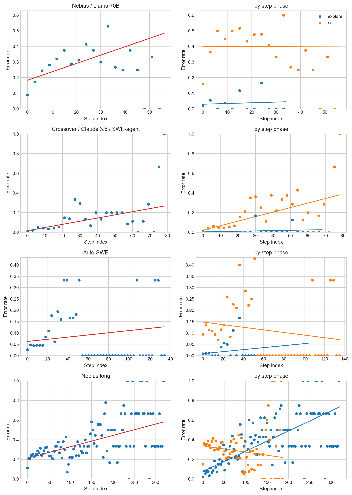

# Do AI Agents Degrade Over Long Tasks?

A statistical pipeline tested this across 15 configurations (8+ models, 4 scaffoldings, ~24,000 graded steps). Every apparent degradation signal turned out to be a measurement artifact.

## The result

The pipeline's first run found statistically significant degradation (+0.0063 errors/step, p<0.0001). Each additional control eliminated most of the remaining signal:

| What changed | step_index slope | p-value | What it revealed |
|---|---|---|---|
| Raw per-trace OLS | +0.029 | varies by trace | -- |
| + Mixed-effects controls | +0.0063 | <0.0001 | Task variance, outcome bias |
| + Step-phase covariate | +0.0006 | 0.68 | Phase-composition artifact |

Agents explore early (reads, searches -- low error rate) and act late (edits, test runs -- high error rate). That phase shift looked like degradation until controlled for:



A second round of corrections targeted the step-phase classifier itself, which was misclassifying 30-60% of steps on 3 of 4 frameworks. Fixing it eliminated 4 more apparent degradation signals across other configurations.

After all corrections across 15 configurations: 8 show no effect, 6 show significant improvement over time, 1 shows degradation that doesn't replicate on an independent sample. The improvement signals were investigated separately (`scripts/analyze_improvement.py`). Backfilling outcome labels from Multi-SWE-bench trajectory scores showed that improvement survives outcome control -- it is present in both successful and failed traces. Two of the 6 are floor effects (<0.5% base error rate, 4 total errors each). The remaining 4 substantive improvement signals are robust to all available controls (phase, complexity, outcome). Whether this reflects genuine within-run adaptation or an uncontrolled confound is an open question.

## Why this matters

Teams build context management into agent scaffolding -- sliding windows, summarization chains, agent restarts -- for good reasons: cost, latency, and rate limits all scale with context length. But these techniques are also commonly justified by the assumption that long contexts degrade accuracy. This study tests that specific claim. If accuracy degradation isn't real (or is much smaller than assumed), the accuracy rationale drops out, and context management decisions can focus on the cost/latency tradeoffs that actually matter. This pipeline exists so anyone can measure it on their own setup rather than assuming.

## Related work

Long-context accuracy degradation is well-documented for *retrieval* tasks. Liu et al. 2024 ("Lost in the Middle") showed that LLMs struggle to use information placed in the middle of long contexts, and needle-in-a-haystack benchmarks measure how reliably models retrieve specific facts as context grows. These are real effects, but they test a different capability than what agents do during a task: retrieving a planted fact from a long prompt is not the same as generating a correct next action given the full history of prior actions.

The assumption that agents degrade over long tasks appears widely in framework documentation, blog posts, and conference talks -- typically framed as "context window limitations" or "attention degradation" -- but there does not appear to be published work measuring within-run step-level error trajectories for coding agents specifically. The closest prior work is Anthropic's "Demystifying Evals" (2025), which discusses per-step evaluation methodology for agents but does not report degradation measurements. TRAIL (Patronus AI) provides expert-annotated step-level labels but reports full-trace accuracy, not temporal patterns.

This study fills that gap: instead of assuming degradation exists and building around it, or assuming it doesn't and ignoring it, it measures the step-level error trajectory directly and decomposes it from confounds.

## The tool

[**inspect-degradation**](https://github.com/reffdev/inspect-degradation) -- an Inspect AI extension that decomposes agent traces into per-step structured judgments, validates the grader against human labels, corrects downstream statistics for grader noise, and runs the full analysis battery. The tool is a reusable package; this repo documents the study conducted with it.

## Approach

This started as a straightforward measurement project: grade agent steps, fit a regression, report the slope. Each round of controls revealed a new confound, and the initial result didn't survive any of them.

**Grader validation.** 7 grader configurations were tested against TRAIL's human labels. Cheap models match frontier, ensembles don't beat the best single model, and rubric iteration has negative returns. MiniMax ($0.40/M) was selected for the degradation analysis. A separate finding: LLM graders naturally calibrate to MEDIUM+ impact errors, ignoring cosmetic LOW-impact issues. This held across all 5 model families tested and likely generalizes to LLM-as-judge systems beyond this study.

**Degradation analysis.** The first dataset (Nebius / Llama 70B, 30 traces) showed clear degradation. Adding mixed-effects controls cut the coefficient by 4x. Adding a step-phase covariate eliminated it entirely -- the "degradation" was agents shifting from exploration to action over the course of a task.

14 more configurations tested whether this pattern held. It did, but with a complication: the step-phase classifier -- originally built for SWE-agent's shell commands -- was misclassifying 30-60% of steps on frameworks using structured tool calls (OpenHands bracket commands, Auto-SWE function calls). Fixing the classifier eliminated 4 more apparent degradation signals. The measurement tool was producing the artifact it was designed to detect.

The classifier required framework-specific detection layers. Each framework has a different interaction pattern -- SWE-agent uses XML blocks, OpenHands uses bracket commands with subcommands (`[str_replace_editor] view` is explore, `[str_replace_editor] str_replace` is act), terminus uses its own XML format, Auto-SWE uses structured tool calls. Getting classification wrong produced convincing false positives.

## What actually predicts step-level errors

Step position is not a significant predictor in 14 of 15 configurations. What is:

- **What the agent is doing.** Action steps (edits, test runs) have 11-30pp higher error rates than exploration steps (reads, searches), p<0.0001 across all configurations. This is the dominant predictor.
- **Model quality.** Error rates range from 2.1% (Qwen3-Coder) to 26% (Llama 70B). Claude 3.7 Sonnet sits at 4% on SWE-smith.
- **Errors are independent, not cascading.** Mean cascade chain length 1.06 across all datasets. When an agent makes an error, the next step is essentially independent -- errors don't snowball.

A targeted follow-up on 50 traces with 40+ steps (3,800 steps, Llama 70B/8B/405B) tested whether degradation appears under context-window pressure specifically. Result: step_index = +0.0001 (p=0.375). Productive rate collapsed to 2.7% -- long traces are agents that are stuck, not agents that are degrading.

See [FINDINGS.md](FINDINGS.md) for the full cross-dataset table, per-configuration regression outputs, grader validation details, and all caveats.

## Scope and limitations

The primary contribution is the measurement methodology and reusable tooling, not a definitive answer to "do agents degrade?" Power analysis shows these corpus sizes (30-50 traces, 15-25 steps) can detect slopes of ~0.01 errors/step at 80% power -- a 15-step trace accumulating 15% more errors by its end. Smaller effects (<0.005/step) are below the detection floor. The null results rule out large degradation but cannot distinguish "no effect" from "very small effect." See the [power analysis](FINDINGS.md#power-analysis) for the full table.

Key caveats:
- **No inter-human baseline.** TRAIL's inter-annotator agreement is unpublished.
- **Grader validated on short traces only.** Validation used ~10 steps/trace; analysis traces run 10-100 steps with 42% hitting the prior-context cap.
- **Context management is unknown for most scaffoldings.** If a framework silently drops context, the step_index axis becomes unreliable.
- **The rubric has not been validated by human experts** independent of the TRAIL labels.
- **Improvement signals survive available controls but are not fully explained.** 4 of 6 are substantive; 2 are floor effects. Outcome control does not reduce the signal. See [FINDINGS.md](FINDINGS.md#cross-dataset-summary).

## Reproducing this study

All graded traces are cached in `results/` -- analysis scripts are deterministic and produce identical output on rerun. Each grading run records an ExperimentConfig envelope (model, rubric version, git commit, timestamps). The study scripts in [scripts/](scripts/) are the exact configurations used for each run. They require [inspect-degradation](https://github.com/reffdev/inspect-degradation) installed and API credentials configured.

To regenerate all derived outputs:

```bash
python scripts/phase_robustness.py      # interaction + stratified + proportion analysis
python scripts/run_power_analysis.py     # power table with actual corpus parameters
python scripts/generate_figures.py       # all figures in figures/
```
